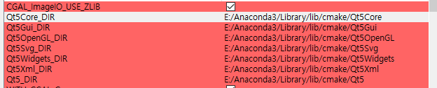
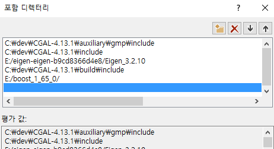
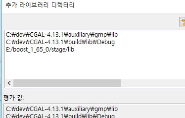
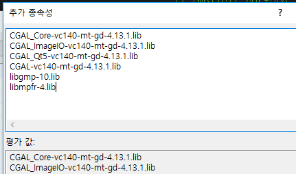
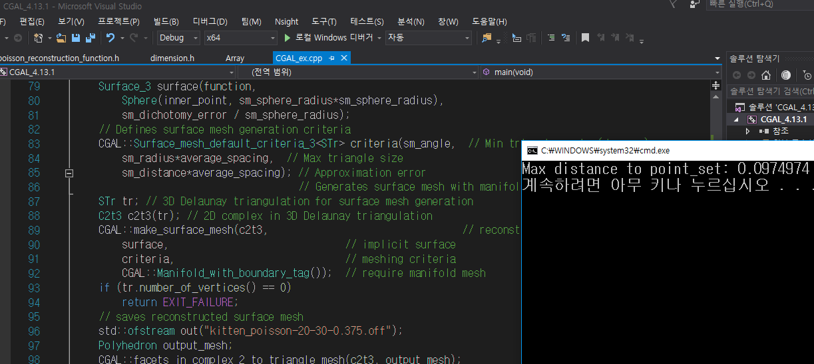
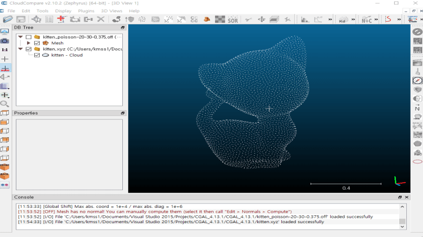

# CGAL-setup
CGAL setup 과정
환경 : VS 2015, CMake 3.9.3, Boost 1.65, CGAL 4.13.1    
QT는 CMake 등에 포함이 되어는 있지만 사용하지는 않았음     
Reference : http://bitly.kr/02p8xj      


# CMake 다운로드
CMake를 설치. 필자는 3.9 버전 설치하였음

# CGAL setup 파일 다운로드
LINK : https://www.cgal.org/download.html    
해당 파일을 다운로드 하면 CMake를 컴파일 할 수 있는 환경이 갖춰짐

# Boost Library 다운로드
필자는 1.65.0 버전을 다운로드 하여 사용하였음.    
include 경로와 lib, bin 경로를 미리 알아두기 

```
include : E:\boost_1_65_0
lib : E:\boost_1_65_0\stage\lib
bin : E:\boost_1_65_0\stage\lib
```

# Eigen 다운로드
3.2.10 버전 다운로드    

# QT 다운로드
필자의 경우 이전에 Anaconda에서 QT 라이브러리를 다운로드 받은 적이 있어서 그걸 그대로 CMake에서 인식하였다.    


# CGAL exe 파일 실행
CGAL을 실행하여 CMake에 필요한 파일을 압축 해제한다.

# CMake 실행

Source Code    
> C:/dev/CGAL-4.13.1    

Build    
> C:/dev/CGAL-4.13.1/build (폴더를 생성하였음)

```
EIGEN_INCLUDE_DIR : E:/eigen-eigen-b9cd8366d4e8/Eigen_3.2.10
WITH_EIGEN : check
QT 관련 : 위 사진과 같음
Boost_LIBRARY_DEBUG & RELEASE : E:/boost_1_65_0/stage/lib
Boost_INCLUDE_DIR : E:/boost_1_65_0/

추가로 WITH_Example 를 체크 하면 관련 예제를 저장할 수 있다.
```

이후, Configure, Generate, Open Project 순서대로 클릭    
프로젝트가 열리면 ALL_BUILD 프로젝트를 시작 프로젝트로 지정하여, 빌드하면 된다. 

# Library 연동
아래와 같이 연동하면 된다.    
    
## Include 경로 설정


## Library 경로 설정


## Library Files
    
연동되는 DLL 파일의 경우에는 프로젝트 경로에 넣고 실행하였다.


# Source Code 실행

예제는 poisson reconstruction 링크를 활용하였으며,     
    
kitten.xyz 파일은 다음 링크에서 받을 수 있다.    
[File](kitten.xyz)    


```
#define CGAL_EIGEN3_ENABLED

#include <CGAL/trace.h>
#include <CGAL/Exact_predicates_inexact_constructions_kernel.h>
#include <CGAL/Polyhedron_3.h>
#include <CGAL/Surface_mesh_default_triangulation_3.h>
#include <CGAL/make_surface_mesh.h>
#include <CGAL/Implicit_surface_3.h>
#include <CGAL/IO/facets_in_complex_2_to_triangle_mesh.h>
#include <CGAL/Poisson_reconstruction_function.h>
#include <CGAL/Point_with_normal_3.h>
#include <CGAL/property_map.h>
#include <CGAL/IO/read_xyz_points.h>
#include <CGAL/compute_average_spacing.h>
#include <CGAL/Polygon_mesh_processing/distance.h>
#include <vector>
#include <fstream>

//#define _AFXDLL
//#include "Afx.h"

// Types
typedef CGAL::Exact_predicates_inexact_constructions_kernel Kernel;
typedef Kernel::FT FT;
typedef Kernel::Point_3 Point;
typedef CGAL::Point_with_normal_3<Kernel> Point_with_normal;
typedef Kernel::Sphere_3 Sphere;
typedef std::vector<Point_with_normal> PointList;
typedef CGAL::Polyhedron_3<Kernel> Polyhedron;
typedef CGAL::Poisson_reconstruction_function<Kernel> Poisson_reconstruction_function;
typedef CGAL::Surface_mesh_default_triangulation_3 STr;
typedef CGAL::Surface_mesh_complex_2_in_triangulation_3<STr> C2t3;
typedef CGAL::Implicit_surface_3<Kernel, Poisson_reconstruction_function> Surface_3;


int main(void)
{
	// Poisson options
	FT sm_angle = 20.0; // Min triangle angle in degrees.
	FT sm_radius = 30; // Max triangle size w.r.t. point set average spacing.
	FT sm_distance = 0.375; // Surface Approximation error w.r.t. point set average spacing.
							// Reads the point set file in points[].
							// Note: read_xyz_points_and_normals() requires an iterator over points
							// + property maps to access each point's position and normal.
							// The position property map can be omitted here as we use iterators over Point_3 elements.
	PointList points;

	std::ifstream stream("kitten.xyz");
	if (!stream ||
		!CGAL::read_xyz_points(
			stream,
			std::back_inserter(points),
			CGAL::parameters::normal_map(CGAL::make_normal_of_point_with_normal_map(PointList::value_type()))))
	{
		std::cerr << "Error: cannot read file data/kitten.xyz" << std::endl;
		return EXIT_FAILURE;
	}
	// Creates implicit function from the read points using the default solver.
	// Note: this method requires an iterator over points
	// + property maps to access each point's position and normal.
	// The position property map can be omitted here as we use iterators over Point_3 elements.
	Poisson_reconstruction_function function(points.begin(), points.end(),
		CGAL::make_normal_of_point_with_normal_map(PointList::value_type()));
	// Computes the Poisson indicator function f()
	// at each vertex of the triangulation.
	if (!function.compute_implicit_function())
		return EXIT_FAILURE;
	// Computes average spacing
	FT average_spacing = CGAL::compute_average_spacing<CGAL::Sequential_tag>(points, 6 /* knn = 1 ring */);
	// Gets one point inside the implicit surface
	// and computes implicit function bounding sphere radius.
	Point inner_point = function.get_inner_point();
	Sphere bsphere = function.bounding_sphere();
	FT radius = std::sqrt(bsphere.squared_radius());
	// Defines the implicit surface: requires defining a
	// conservative bounding sphere centered at inner point.
	FT sm_sphere_radius = 5.0 * radius;
	FT sm_dichotomy_error = sm_distance*average_spacing / 1000.0; // Dichotomy error must be << sm_distance
	Surface_3 surface(function,
		Sphere(inner_point, sm_sphere_radius*sm_sphere_radius),
		sm_dichotomy_error / sm_sphere_radius);
	// Defines surface mesh generation criteria
	CGAL::Surface_mesh_default_criteria_3<STr> criteria(sm_angle,  // Min triangle angle (degrees)
		sm_radius * average_spacing,  // Max triangle size
		sm_distance * average_spacing); // Approximation error
									  // Generates surface mesh with manifold option
	STr tr; // 3D Delaunay triangulation for surface mesh generation
	C2t3 c2t3(tr); // 2D complex in 3D Delaunay triangulation
	CGAL::make_surface_mesh(c2t3,                                 // reconstructed mesh
		surface,                              // implicit surface
		criteria,                             // meshing criteria
		CGAL::Manifold_with_boundary_tag());  // require manifold mesh
	if (tr.number_of_vertices() == 0)
		return EXIT_FAILURE;
	// saves reconstructed surface mesh
	std::ofstream out("kitten_poisson-20-30-0.375.off");
	Polyhedron output_mesh;
	CGAL::facets_in_complex_2_to_triangle_mesh(c2t3, output_mesh);
	out << output_mesh;
	// computes the approximation error of the reconstruction
	double max_dist =
		CGAL::Polygon_mesh_processing::approximate_max_distance_to_point_set(output_mesh,
			points,
			4000);
	std::cout << "Max distance to point_set: " << max_dist << std::endl;
	return EXIT_SUCCESS;
}
```

# RESULT

결과로는 Point Cloud와 생성된 Surface간의 거리가 출력 된다.    
    

# PointCloud & Recon. Surface Rendering

kitten.xyz와 Poisson Reconstruction된 Surface의 결과를 보이면 아래와 같다.    
    
    
    


    
